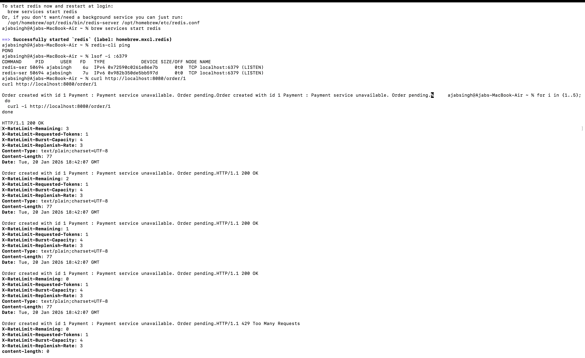

# Microservices Architecture with Eureka Server and JWT Authentication

## 📌 Project Overview
This project follows a **Microservices Architecture** using **Spring Boot** and **Spring Cloud**.  
It uses:
- **Eureka Server** for service discovery
- **Auth Service** for authentication and JWT token generation
- **API Gateway** for routing and security enforcement

All secured requests use **JWT Bearer Tokens**.

---

## 🧩 Microservices Architecture Flow (with Auth & JWT)

```text
Client (Web / Mobile)
        |
        | 1. Login Request (username/password)
        v
-----------------------
|   Auth Service      |
|  (JWT Generator)   |
-----------------------
        |
        | 2. JWT Token
        v
Client (stores token)
        |
        | 3. Request with Header:
        |    Authorization: Bearer <JWT>
        v
-----------------------
|   API Gateway      |
-----------------------
        |
        | 4. Token Validation
        v
-----------------------
|   Eureka Server    |
-----------------------
        |
        v
------------------------------------------------
| Order Service | Payment Service | Inventory  |
| Notification Service                          |
------------------------------------------------
        |
        v
   Database (per service)
```
- **Added Circuit Breaker in Order Service- FallbackFactory if payment service down
- **Added Circuit Breaker in Gateway- Fallback if Order service down

Spring Boot provides logging out of the box using SLF4J and Logback, so no additional dependency is required for logging in API Gateway.
---
Correlation ID
Logging
Auth
Routing
---
Exception handling should be layered.
Gateway handles infrastructure failures and routing errors.
Each microservice uses @ControllerAdvice for business and validation exceptions.
Correlation ID ensures traceability across logs.
Circuit breakers provide graceful degradation.
---------
Correct order:
Client
↓
API Gateway
↓
[ Rate Limiting ]
↓
[ Authentication / JWT ]
↓
[ Circuit Breaker ]
↓
Service Discovery
↓
Microservice

Rate limiting should be applied before circuit breaking so that excessive traffic is blocked early and does not affect circuit breaker metrics or backend health.
test:

---